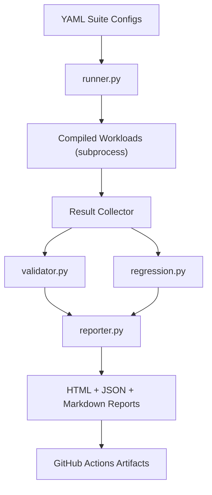

# Automated Test Harness for Compute Workloads

A Python-based regression harness that executes parameterized compute workloads, validates correctness and performance constraints from YAML config files, compares results against stored baselines, and emits HTML/JSON/Markdown reports suitable for CI pipelines.

## Why This Matters

This mirrors real validation infrastructure patterns: declarative tests, reproducible execution, automated checks, regression gates, and machine + human-readable reporting.

## Architecture



## Repository Layout

```text
compute-test-harness/
├── workloads/
│   ├── matrix_multiply.c
│   ├── memory_bandwidth.c
│   └── vector_add.c
├── configs/
│   ├── suite_correctness.yaml
│   ├── suite_performance.yaml
│   └── suite_regression.yaml
├── harness/
│   ├── runner.py
│   ├── validator.py
│   ├── regression.py
│   └── reporter.py
├── baselines/
│   └── baseline.json
├── reports/
│   └── latest/
├── tests/
│   └── test_runner.py
├── .github/workflows/test_ci.yml
├── Makefile
├── requirements.txt
└── README.md
```

## Core Features

- YAML-driven suite definitions (workload, args, exit code, checksum, max runtime).
- Subprocess runner with stdout/stderr capture and timing.
- Correctness + performance validation with explicit failure reasons.
- Baseline regression detection with configurable threshold.
- Report generation to:
  - `reports/latest/results.json`
  - `reports/latest/summary.md`
  - `reports/latest/report.html`

## Local Run (3 Commands)

```bash
python3.12 -m venv .venv && source .venv/bin/activate
pip install -r requirements.txt
make build run
```

Optional baseline refresh:

```bash
make update-baseline
```

## Docker

```bash
docker build -t compute-test-harness .
docker run --rm -it -v "$(pwd)":/app compute-test-harness bash
```

Inside container:

```bash
make build run
```

## Config Example

```yaml
suite_name: performance

tests:
  - name: matrix_perf_guard
    workload: matrix_multiply
    args: [96, 1]
    expected_exit_code: 0
    max_time_ms: 1000
```

## Regression Strategy

Each test stores a baseline elapsed runtime. A regression is flagged when:

- `current_elapsed_ms > baseline_elapsed_ms * (1 + threshold)`

Default threshold: `15%`.

## CI/CD

GitHub Actions workflow (`.github/workflows/test_ci.yml`) performs:

1. Build workloads
2. Run harness unit tests
3. Execute all YAML suites
4. Upload latest HTML/JSON/Markdown report artifacts

## Interview Talking Points

- Declarative test design in YAML enables easy suite expansion without code changes.
- Runner and validator separation keeps execution and policy logic clean.
- Regression gate prevents silent performance degradation in CI.
- Structured reports support both automated ingestion and reviewer triage.

## Tech Stack

- Python: subprocess, dataclasses-style dict records, PyYAML, Jinja2, pytest
- C: deterministic compute workloads
- CI: GitHub Actions
